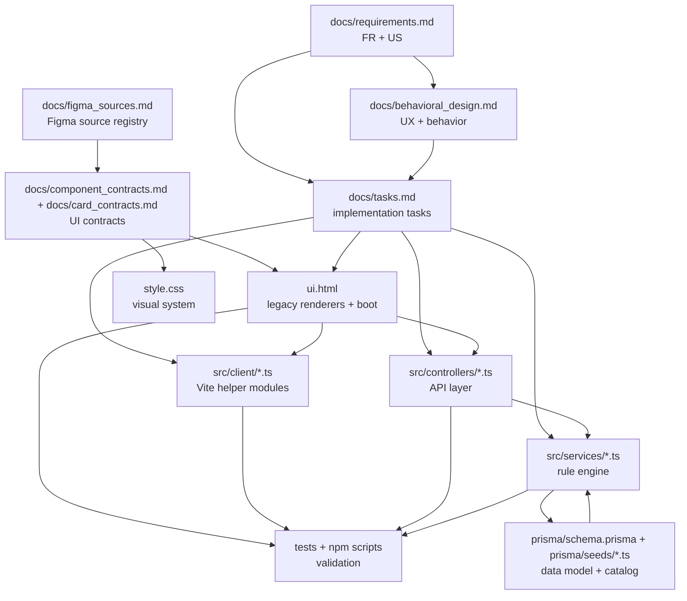
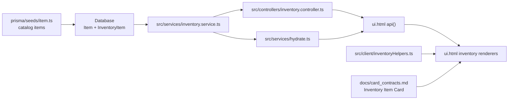

# Architecture Map

Mapa de arquitectura funcional para que personas y Graphify conecten capas que antes aparecían como comunidades separadas.

## Capas Principales

## Frontend Runtime

`ui.html` remains the main player-facing UI shell. `src/client/main.ts` is the Vite entrypoint that imports extracted modules and publishes readiness.

Runtime globals:

- `window.DND_PUBLIC_CONFIG` from `config.public.js`.
- `window.DND_UTILS` from `src/client/legacy-utils.ts`.
- `window.DND_PREVIEW_API` from `src/client/preview.ts`.
- `window.DND_ITEM_HELPERS` from `src/client/inventoryHelpers.ts`.
- `window.DND_CLIENT_READY` from `src/client/main.ts`.
- `dnd-client-ready` event dispatched by `src/client/main.ts`.

Boot functions:

- `ui.html` function `startAuthOnce()` starts auth safely.
- `ui.html` function `initAuth()` loads profile and roster.
- `ui.html` function `api(method, path, body)` routes real API calls or preview API calls.
- `ui.html` function `refreshItemDisplaysAfterHelpersReady()` re-renders visible inventory after helper readiness.

Graphify bridge:

- `Main Module` should connect to `Preview Mode`, `Inventory Helpers`, `Legacy Utils`, `ui.html boot`, `US-147`, `US-148`, `T-080`, `T-081`, `T-084`, `T-086`.

## Inventory Architecture

Inventory has four connected concerns:

- Rule/data layer: `prisma/seeds/item.ts`, `src/services/inventory.service.ts`, `src/controllers/inventory.controller.ts`.
- Hydration layer: `src/services/hydrate.ts` attaches computed inventory state to character detail.
- UI helper layer: `src/client/inventoryHelpers.ts` normalizes labels, item types, chips, descriptions, images and fallback icons.
- UI rendering layer: `ui.html` renders tabs, cards, catalog add flow, quantity screen and item detail modal.

Data flow:

Key renderers:

- `renderDetailInventory(c)`.
- `renderInventoryBackpackView(items)`.
- `renderInventoryEquipmentView(items)`.
- `renderInventoryStashView(items)`.
- `renderInventoryItemCard(inv, options = {})`.
- `renderInventoryCatalogCard(item)`.
- `openInventoryQuantityScreen(itemId)`.
- `openItemDescriptionDrawer(encodedItemId)`.

Key helper functions:

- `itemLookupKey(value)`.
- `itemLabel(name)`.
- `itemTypeLabel(item)`.
- `itemRuleChips(item)`.
- `itemDescription(item)`.
- `itemImagePath(item)`.
- `fallbackItemIconSvg(item)`.
- `itemImageHtml(item, altText)`.

Docs that define behavior:

- `docs/requirements.md` sections `US-122`, `US-127`, `US-137`, `US-141`, `US-145`, `US-146`, `US-148`.
- `docs/behavioral_design.md` area `Inventario y equipamiento`, `US-145`, `US-146`, `US-148`.
- `docs/tasks.md` tasks `T-081`, `T-082`, `T-083`, `T-085`, `T-086`.
- `docs/traceability.md` section `Inventario: Identidad Visual, Español Y Helpers`.

## Character Creation Wizard Architecture

The wizard is still implemented in `ui.html` and must remain compatible with preview mode and real API mode.

Data sources:

- Race/class/background/spell/item catalogs from real API.
- Preview catalogs from `src/client/preview.ts`.
- Spanish label maps and catalog normalization in `ui.html`.

Key functions:

- `wizardOpen()`.
- `wizLoadCatalog()`.
- `wizRenderStep(n)`.
- `wizFlow()`.
- `wizPdfGeneralHTML()`.
- `wizPdfRaceHTML()`.
- `wizPdfBackgroundHTML()`.
- `wizPdfClassHTML()`.
- `wizPdfEquipmentHTML()`.
- `wizPdfCantripsHTML()`.
- `wizPdfAttributesHTML()`.
- `wizardFinish()`.
- `catalogLookupKey(value)`.
- `raceNameEs(value)`.
- `classNameEs(value)`.
- `backgroundNameEs(value)`.

Figma sources:

- `--flow-characterCreation`.
- `--characterCreation-raceSelection`.
- `--characterCreation-backgroundSelection`.
- `--characterCreation-classSelection`.
- `--characterCreation-equipmentSelection-unselected`.
- `--characterCreation-equipmentSelection-selected`.
- `--characterCreation-spellSelection-unselected`.
- `--characterCreation-spellSelection-selected`.
- `--characterCreation-attributesConfig-unselected`.
- `--characterCreation-attributesConfig-selected`.

Docs that define behavior:

- `docs/requirements.md` `US-122`, `US-135`, `US-136`, `US-146`.
- `docs/behavioral_design.md` `US-146`.
- `docs/card_contracts.md` sections `Race Card`, `Class Card`, `Background Card`, `Equipment Selection Card`, `Spell Card`.
- `docs/traceability.md` section `Character Creation Wizard`.

## Figma Contract Architecture

Figma does not directly drive runtime. It drives contracts that code must follow.

Source hierarchy:

1. `docs/figma_sources.md` names the source keys and node IDs.
2. `docs/design_tokens.md` maps reusable colors, type, spacing, radii, shadows and assets.
3. `docs/screen_contracts.md` maps screens and flows.
4. `docs/component_contracts.md` maps reusable atoms and modules.
5. `docs/card_contracts.md` maps repeated card structures.
6. `docs/qa_checklist.md` defines visual and functional verification.

Implementation targets:

- `ui.html` renderers.
- `style.css` tokens and component styles.
- `src/client/*` helper modules when behavior is shared.

Required documentation updates:

- Always update `CHANGELOG.md` and `HANDOFF.md`.
- If behavior or product requirements change, update `docs/requirements.md`, `docs/tasks.md` and `docs/behavioral_design.md`.
- If UI source mappings change, update `docs/figma_sources.md`, `docs/component_contracts.md`, `docs/card_contracts.md` or `docs/screen_contracts.md`.
- If traceability changes, update `docs/traceability.md`.

## Backend Rule Engine Architecture

The backend is organized around controllers, pure services, Prisma repositories/data and tests.

Core services:

- `src/services/hydrate.ts` produces the character detail payload used by UI.
- `src/services/armor.service.ts` calculates Armor Class.
- `src/services/hp.service.ts` calculates hit points.
- `src/services/inventory.service.ts` applies inventory/equipment rules.
- `src/services/attack.service.ts` calculates attack bonuses.
- `src/services/spell-slot.service.ts` handles spell slots and rest recovery.
- `src/services/condition.service.ts` handles condition state.
- `src/services/ability-score.service.ts` validates point buy and modifiers.

Controllers:

- `src/controllers/character.controller.ts`.
- `src/controllers/inventory.controller.ts`.
- `src/controllers/spell.controller.ts`.
- `src/controllers/auth.controller.ts`.
- `src/controllers/condition.controller.ts`.
- `src/controllers/rest.controller.ts`.

Data:

- `prisma/schema.prisma`.
- `prisma/seeds/*.ts`.
- `src/repositories/*.ts`.

Docs:

- `docs/requirements.md` core FR and US.
- `docs/plan.md` architecture plan and hydration flow.
- `docs/tasks.md` service/API implementation tasks.
- `docs/traceability.md` section `Backend Rule Engine And Hydration`.

## Validation Architecture

Use the smallest validation that proves the touched layer:

- Documentation only: `git diff --check`.
- Frontend helpers/UI: `npm run typecheck:web`, `npm run build:web`, browser preview when visual.
- Backend/service: `npm run typecheck`, targeted tests, then broader `npm run test` when shared rules change.
- Public publish/security: `npm run prepublish:check`.
- Graph map freshness: `/Users/migueleo/.local/bin/graphify update .` after code changes; `graphify extract . --backend openai` after documentation bridge changes when semantic edges matter.

## Known Architecture Gaps

- `ui.html` is still the largest legacy surface and contains many renderers that should eventually move into `src/client` modules.
- `window.DND_ITEM_HELPERS` readiness needs further investigation in the in-app browser; inventory fallbacks now protect the UI, but the root readiness path should be audited.
- Some Figma sources still need numeric token extraction via Figma MCP before declaring 1:1 visual parity.
- Graphify can show silos when links are only implicit; keep `docs/traceability.md` updated with explicit file/function/story/task names.

